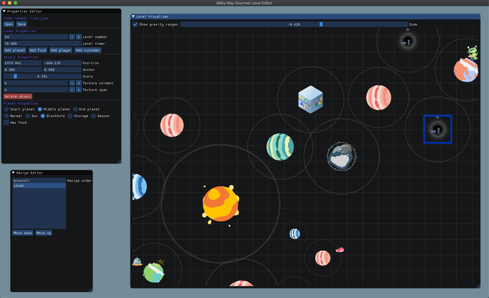

# Milky Way Gourmet Level Editor

A level editor for Milky Way Gourmet, a space cooking game for mobile.



# Building

## macOS and Linux

Create a build directory (you only need to do this once):

```
mkdir build
cd build
```

Build (necessary each pull, make sure you're inside the `build` directory already):

```
cmake ..
make
```

Run the level editor (inside `build`):

```
./mwgeditor
```

## Windows

### Visual Studio

* Make sure you have "Desktop development with C++" and "Linux Development with C++" workloads installed. See here: https://docs.microsoft.com/en-us/cpp/build/cmake-projects-in-visual-studio?view=vs-2019#installation
* Open the repo folder, open the `CMakeLists.txt`, and click the run button near the top. Video: https://streamable.com/uxhy24

### CLion

* Open the repo folder as a CMake project.
